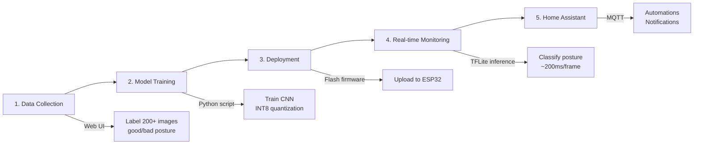

# PosturePilot

**Posture correction that escalates from gentle reminders to an airhorn.**

[](https://opensource.org/licenses/MIT)
[](https://github.com/elektricM/posture-pilot/actions/workflows/build.yml)
[](https://platformio.org/)
[](https://www.espressif.com/en/products/socs/esp32-s3)
[](CONTRIBUTING.md)

A tiny ESP32 camera that watches your posture and gets increasingly aggressive until you sit up straight. Uses a custom TFLite model trained on your own posture data, integrated with Home Assistant.

<!-- TODO: Add demo GIF -->
<!--  -->

## ✨ Features

- 🤖 **On-device AI** — TFLite Micro runs entirely on ESP32, no cloud needed
- 📸 **Custom training** — Train on your own posture, adapts to your body and setup
- 📈 **Escalating alerts** — Starts gentle, gets increasingly aggressive if you ignore it
- 🏠 **Home Assistant integration** — MQTT sensors, automations, dashboard cards
- 🔒 **Privacy-first** — All processing local, camera never leaves the device
- 🌐 **Web-based training** — Collect labeled data via browser, no coding needed
- 🔄 **OTA updates** — Flash firmware wirelessly after initial setup
- ⚡ **Lightweight** — 96x96 INT8 quantized model, ~5 FPS inference

## Why?

I slouch constantly. Ergonomic chairs don't help. Those posture reminder apps? I ignore them.

What I needed was something that *escalates* — starts polite but eventually resorts to an airhorn if I keep ignoring it.

## 🔄 How It Works



**Workflow:**

1. **📸 Collect** — Flash in COLLECT mode, open web UI, label 200+ images of good/bad posture
2. **🧠 Train** — Run training script to build INT8 quantized TFLite model from your data
3. **📤 Deploy** — Flash firmware with trained model embedded as C header
4. **👁️ Monitor** — Real-time posture classification at 5fps with progressive escalation
5. **🏠 Integrate** — MQTT publishes to Home Assistant for automations and tracking

The model runs **entirely on the ESP32-S3** using TFLite Micro. No cloud, no latency, no privacy concerns.

## Hardware

| Part | Cost |
|------|------|
| [XIAO ESP32S3 Sense](https://www.seeedstudio.com/XIAO-ESP32S3-Sense-p-5639.html) | ~€15 |
| USB-C cable | — |
| Optional: small speaker | ~€3 |

The XIAO ESP32S3 Sense has everything built in — camera, 8MB PSRAM for the model, and it's tiny (21 x 17.8mm).

## Quick Start

```bash
# 1. Clone and configure
git clone https://github.com/elektricM/posture-pilot.git
cd posture-pilot
cp src/config.example.h src/config.h

# 2. Edit config.h with your WiFi and MQTT details
# Then flash in collect mode (set DEFAULT_MODE = MODE_COLLECT)
pio run -t upload

# 3. Open web UI at http://<device-ip>/ and collect training data

# 4. Train the model
cd scripts
pip install -r requirements.txt
python train_model.py --data ./data --output ../src/model.h

# 5. Switch to monitor mode in config.h and reflash
cd ..
pio run -t upload
```

See [docs/SETUP.md](docs/SETUP.md) for detailed instructions.

## Home Assistant

Add these sensors to `configuration.yaml`:

```yaml
mqtt:
  sensor:
    - name: "Posture Status"
      state_topic: "posture-pilot/status"

    - name: "Posture Level"
      state_topic: "posture-pilot/level"

    - name: "Posture Streak"
      state_topic: "posture-pilot/streak"
      unit_of_measurement: "hours"
```

See [ha-config/](ha-config/) for automations including the airhorn trigger.

## Configuration

All in `src/config.h`:

```cpp
#define SLOUCH_THRESHOLD 0.5f    // Model confidence to trigger (0-1)
#define LEVEL1_SECONDS 30        // Time before first warning
#define LEVEL2_SECONDS 120       // Getting serious
#define LEVEL3_SECONDS 300       // Passive-aggressive
#define LEVEL4_SECONDS 600       // AIRHORN
```

## 📊 Technical Details

- **Hardware**: ESP32-S3 with 8MB PSRAM, OV2640 camera
- **Model**: Custom CNN (32→64→64 filters), INT8 quantized, ~50KB
- **Inference**: 96x96 grayscale input, ~200ms per frame on ESP32
- **Training**: TensorFlow/Keras with quantization-aware training
- **Connectivity**: WiFi 2.4GHz, MQTT, OTA updates
- **Modes**: Dual-mode firmware (COLLECT/MONITOR)

## Project Structure

```
posture-pilot/
├── src/
│   ├── main.cpp           # Main app (mode switching, escalation)
│   ├── inference.h/cpp    # TFLite model loading + inference
│   ├── collector.h/cpp    # HTTP server for data collection
│   ├── model.h            # Trained model (generated)
│   └── config.h           # Your settings
├── scripts/
│   ├── train_model.py     # Training script
│   └── requirements.txt
├── ha-config/             # Home Assistant configs
├── docs/                  # Architecture docs
└── .github/               # CI/CD workflows
```

## Troubleshooting

**Camera not starting** — Make sure PSRAM is enabled in platformio.ini. Check camera ribbon cable is seated properly.

**Model won't load** — Check serial output. Arena might be too small — increase `TENSOR_ARENA_SIZE` in config.h

**Bad accuracy** — Collect more data (300+ images per class), make sure lighting is consistent, try `--transfer` flag

**MQTT not connecting** — Check broker IP, make sure port 1883 isn't blocked. ESP32 only supports 2.4GHz WiFi.

**Build errors** — Make sure `config.h` exists (copy from `config.example.h`). Check PlatformIO is up to date.

## 🤝 Contributing

Contributions are welcome! See [CONTRIBUTING.md](CONTRIBUTING.md) for guidelines.

**Good first issues:**
- Better camera auto-exposure tuning
- Additional sensor board support
- UI improvements for data collection
- More Home Assistant automation examples

## 📄 License

MIT — see [LICENSE](LICENSE) for details.

## ⚠️ Security

See [SECURITY.md](SECURITY.md) for security considerations and best practices.

## 📚 Documentation

- [Setup Guide](docs/SETUP.md) — Detailed installation and configuration
- [Architecture](docs/ARCHITECTURE.md) — How it works under the hood
- [Changelog](CHANGELOG.md) — Version history and changes

## 🌟 Acknowledgments

- [MicroTFLite](https://github.com/johnosbb/MicroTFLite) — TFLite Micro for ESP32
- [Seeed Studio](https://www.seeedstudio.com/) — XIAO ESP32S3 Sense hardware
- Espressif's camera examples and documentation

---

<p align="center">
Made with ☕ by <a href="https://github.com/elektricM">Martin</a>
</p>
